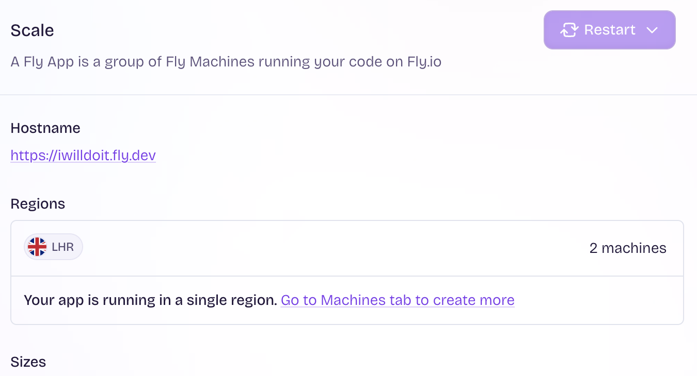
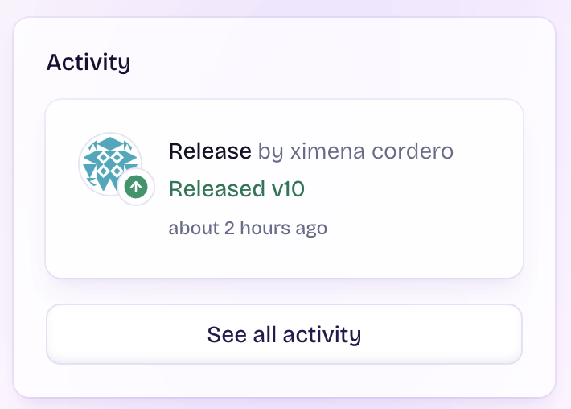
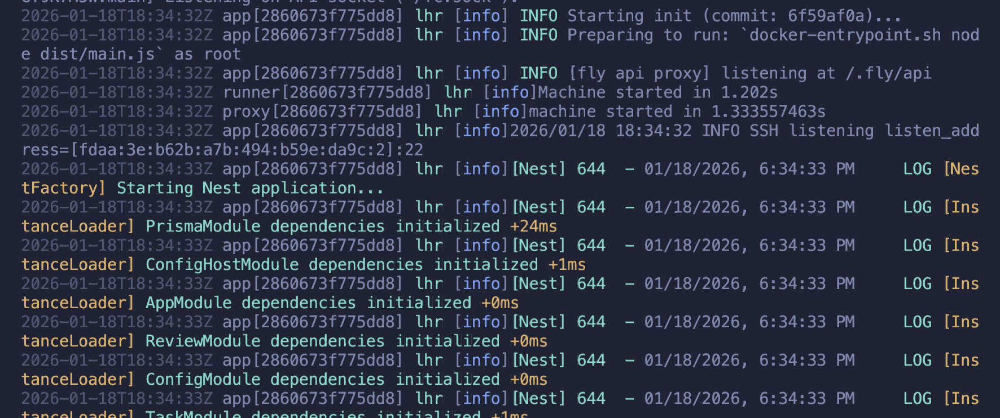
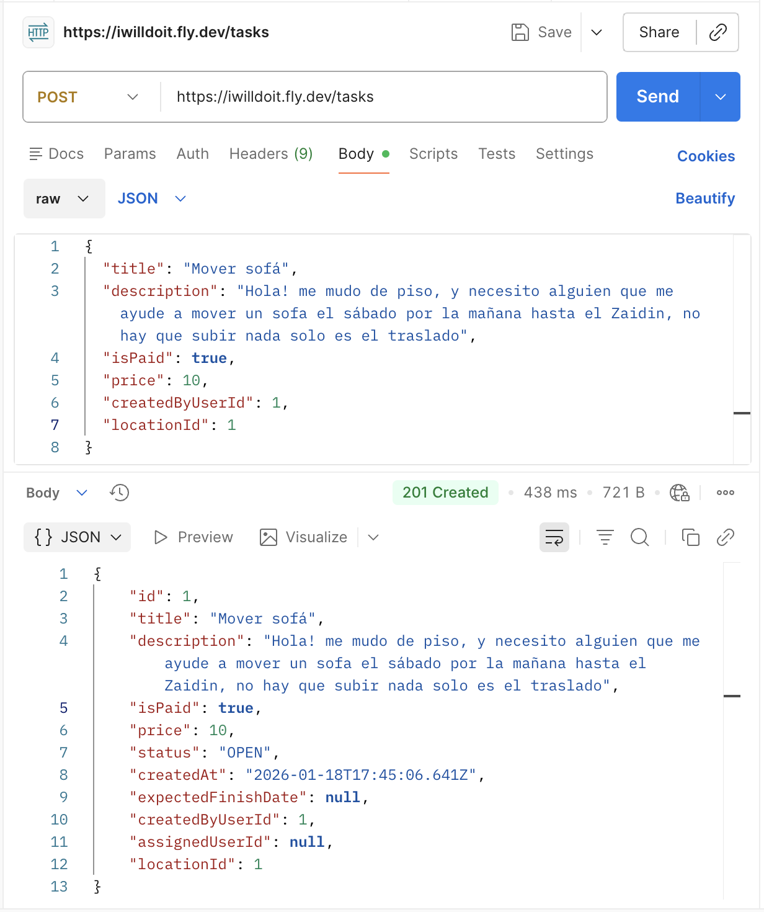
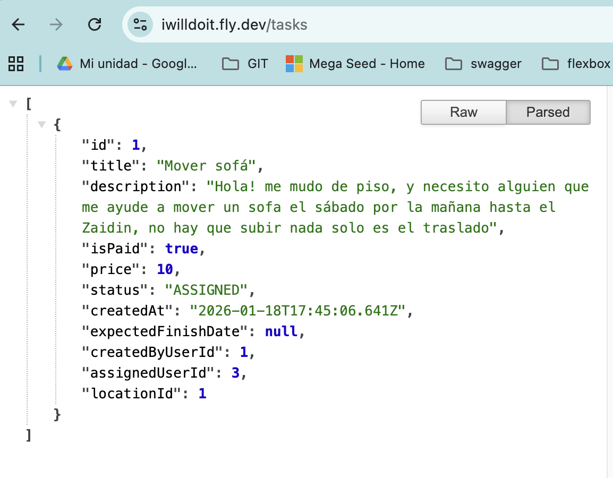

# ☁️ Project Milestone 5 – Cloud Deployment, CI/CD & Observability

## 📍 Status
**Milestone 5 – Cloud Deployment & Observability (✅ Current)**  
**Milestone 4 – Service Composition with Docker Compose (Completed)**  
**Milestone 3 – Microservices Design (Completed)**  
**Milestone 2 – Continuous Integration (Completed)**  
**Milestone 1 – Repository Setup & Project Definition (Completed)**

---

## 🎯 Objective

The goal of **Milestone 5** is to deploy the application developed during previous milestones to a **real cloud environment (PaaS/IaaS)**, ensuring that the deployment is:

- Fully reproducible using configuration-as-code.
- Automatically deployed from a GitHub repository.
- Executed in a European region (legal compliance).
- Observable in real time through logs and metrics.
- Functionally correct under real usage conditions.

This milestone bridges the gap between **local/containerized development** and **production-grade cloud deployment**.

---

## ☁️ Cloud Provider Selection

### Selected Platform: **Fly.io (PaaS)**

Fly.io was selected after evaluating multiple alternatives due to the following reasons:

| Criterion | Fly.io | Justification |
|---------|-------|---------------|
| Infrastructure as Code | ✅ | Declarative configuration via `fly.toml` |
| GitHub-based deployment | ✅ | Deploys directly on `git push` / `fly deploy` |
| European regions | ✅ | Deployment in **London (LHR)** |
| Docker-native | ✅ | Uses the same Docker image as local environments |
| Observability tools | ✅ | Built-in logs, metrics and monitoring |
| Free / Student friendly | ✅ | Suitable for academic projects |

**Alternatives considered:** Railway, Render, AWS ECS/Fargate  

Fly.io was chosen for its balance between **control, simplicity, and reproducibility**.

---

## 🧱 Deployment Architecture

The deployed system consists of:

| Component | Description |
|---------|-------------|
| **NestJS API** | Main backend application |
| **PostgreSQL (Fly.io Managed)** | Production database |
| **Fly Machines** | Isolated runtime instances |
| **Docker Image** | Built via multi-stage Dockerfile |

Key characteristics:

- Same Docker image used locally and in production.
- Stateless application containers.
- Externalized configuration via environment variables.
- Managed database with secure connection pooling.

---

## 📦 Infrastructure Configuration

### Fly.io Configuration (`fly.toml`)

The infrastructure is fully defined using Fly.io configuration files:

- Application name
- Region (`lhr`)
- Exposed port (`3000`)
- Auto-start / auto-stop configuration
- Release command for database migrations

This allows **any authorized user** to reproduce the infrastructure using:

```bash
fly launch
fly deploy
```

---

## 🐳 Docker-Based Deployment

The application is deployed using a **multi-stage Docker build**, ensuring consistency between local development and production environments.

### Build Stage

- Installs all dependencies
- Generates Prisma Client
- Compiles the NestJS application:
  ```bash
  npm run build
    ```

### Production Stage
- Installs only production dependencies
- Includes compiled dist/ output
- Includes Prisma Client and Prisma schema
- Runs the application via:

```bash
  node dist/main.js
```

This approach ensures:
- Minimal image size
- Deterministic builds
- Consistent runtime behavior across environments

---

## CI/CD – Automatic Deployment from GitHub

Deployment is triggered directly from the GitHub repository:

- All source code is versioned in GitHub.
- Any change committed to main can be deployed using:

```bash
  fly deploy
```

- The deployment process:

    1. Builds the Docker image
    2. Pushes it to Fly.io registry
    3. Executes Prisma migrations (`prisma migrate deploy`)
    4. Starts application machines
This fulfills the requirement of **automated deployment from a GitHub repository.**

---

## 🧬 Database & Migrations

The application uses **Prisma ORM** with PostgreSQL.

- Schema defined in schema.prisma
- Migrations stored under prisma/migrations
- Production migrations executed automatically on deploy

Verification command:

```bash
npx prisma migrate status
```

This guarantees that the production database schema matches the application model.

---

## 📡 Observability & Monitoring

### Logs

Fly.io provides real-time log streaming:

```bash
fly logs
```

Logs include:

- Application startup
- HTTP requests
- Prisma database queries
- Runtime and initialization errors

Logs were used extensively to diagnose and resolve:

- Startup failures
- OpenSSL / Prisma runtime issues
- Missing database migrations
- Application crashes

### Metrics & Monitoring

Fly.io’s monitoring dashboard provides:

- CPU and memory usage
- Restart counts
- Machine lifecycle events
- Request routing health

These tools allow real-time observability and validate application stability under load.

---

## 🧪 Functional & Load Testing

### Functional Testing (Production)

The deployed API was tested directly in production using curl and Postman.

**Create User**
```bash
curl -X POST https://iwilldoit.fly.dev/user \
  -H "Content-Type: application/json" \
  -d '{
    "name": "Alice",
    "email": "alice@example.com"
  }'
```

**Create Location**

It associates a location with the user created (`userId = 1`).

```bash
curl -X POST https://iwilldoit.fly.dev/location/1 \
  -H "Content-Type: application/json" \
  -d '{
    "lat": 37.1773,
    "lng": -3.5986,
    "address": "Zaidín, Granada"
  }'
```

**Create Task**

It creates a task associated with the user and location.

```bash
curl -X POST https://iwilldoit.fly.dev/tasks \
  -H "Content-Type: application/json" \
  -d '{
    "title": "Mover sofá",
    "description": "Necesito ayuda para trasladar un sofá este sábado por la mañana.",
    "isPaid": true,
    "price": 10,
    "createdByUserId": 1,
    "locationId": 1
  }'
```

**Create Offer**

A second user makes an offer to perform the task.

```bash
curl -X POST https://iwilldoit.fly.dev/offers \
  -H "Content-Type: application/json" \
  -d '{
    "taskId": 1,
    "userId": 2,
    "message": "Puedo ayudarte el sábado por la mañana sin problema."
  }'
```

### Verify Persistence

```bash
curl https://iwilldoit.fly.dev/user
```

```bash
curl https://iwilldoit.fly.dev/tasks
```

```bash
curl https://iwilldoit.fly.dev/offers
```

Successful responses and persisted records confirm end-to-end correctness.

### Load & Stability Testing

Repeated requests were executed to validate:

- Data persistence
- Concurrent request handling
- Automatic machine start/stop behavior

The application remained stable, with no unexpected crashes or data loss.

---

🌍 **Production URL**

The application is publicly available at:

👉 https://iwilldoit.fly.dev

All API endpoints are accessible and operational.

---

## 📸 Evidence & Captures

The following evidence was collected for evaluation:

- Fly.io dashboard showing deployed application in LHR region






- Logs demonstrating successful application startup



- API requests and responses (curl / Postman)



- Database records confirming persistence



---

## 🔗 References
- [Fly.io Documentation](https://fly.io/docs/)
- [Fly.io Machines](https://fly.io/docs/machines/)
- [Docker Documentation](https://docs.docker.com/)
- [Dockerfile Reference](https://docs.docker.com/engine/reference/builder/)
- [NestJS Documentation](https://docs.nestjs.com/)
- [Prisma Documentation](https://www.prisma.io/docs)
- [Prisma Migrate](https://www.prisma.io/docs/concepts/components/prisma-migrate)
- [PostgreSQL Documentation](https://www.postgresql.org/docs/)
- [GitHub Actions Documentation](https://docs.github.com/en/actions)
- [GitHub Container Registry (GHCR)](https://docs.github.com/en/packages/working-with-a-github-packages-registry)

